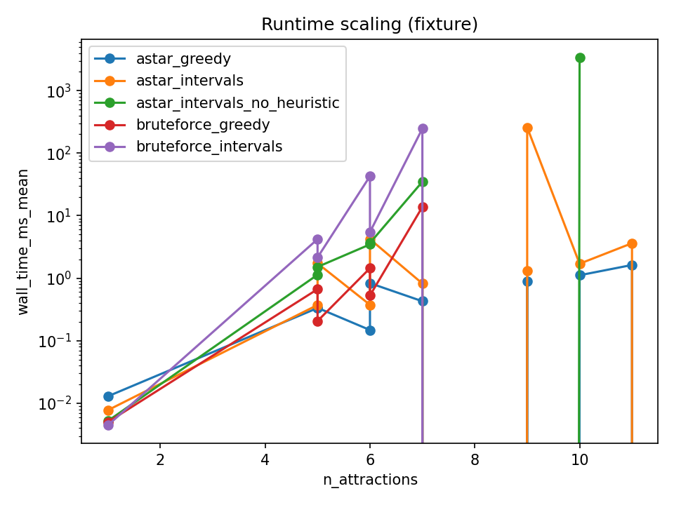
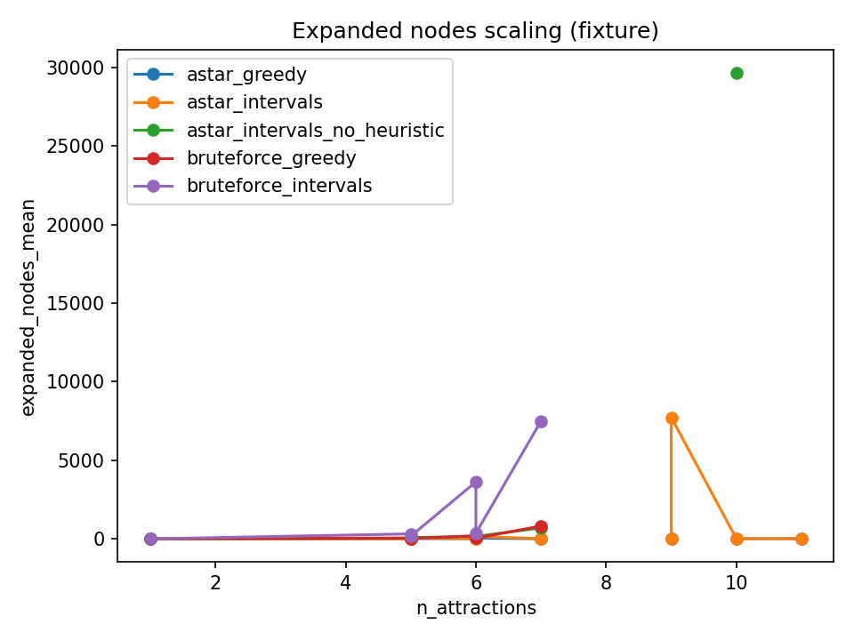
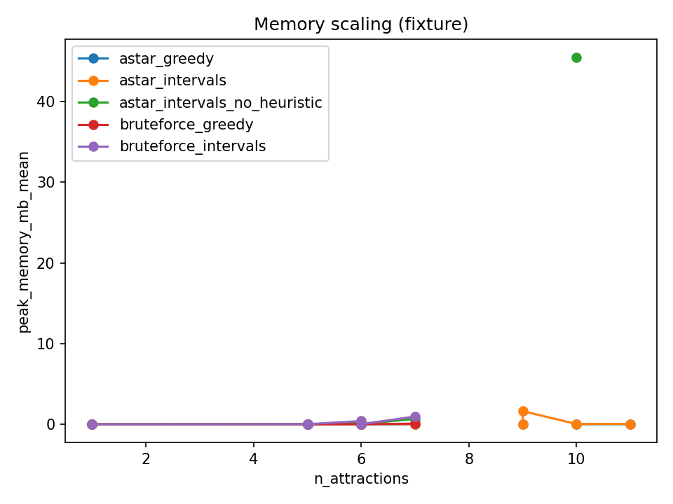
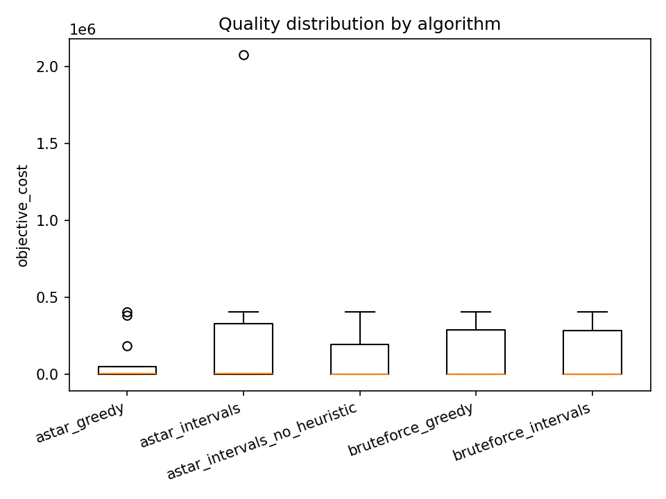
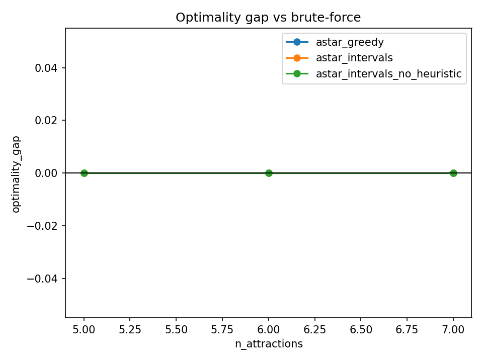
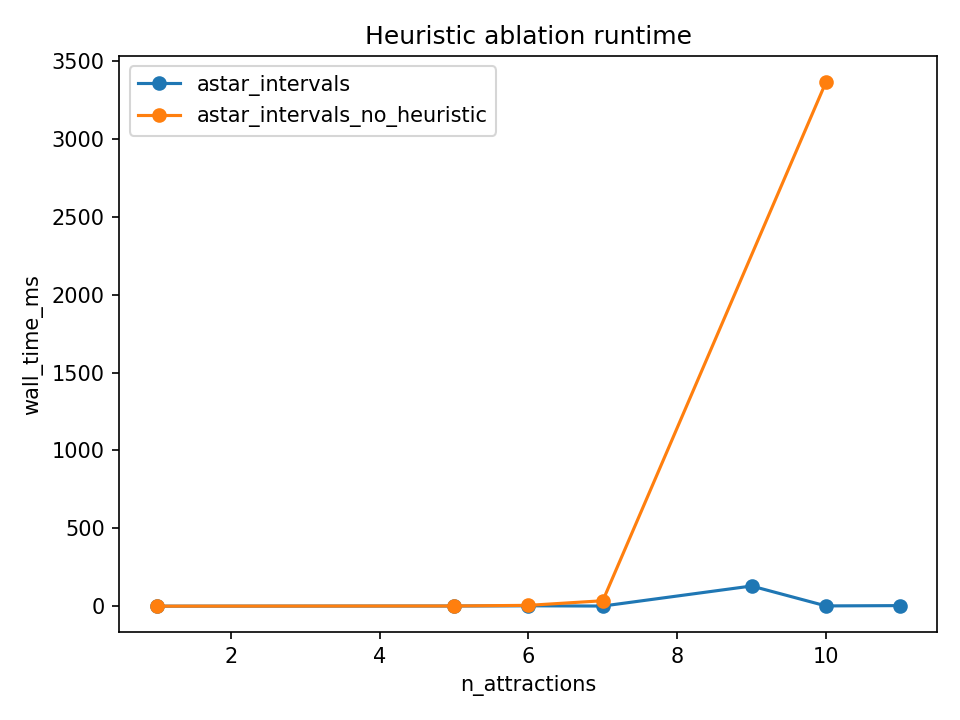
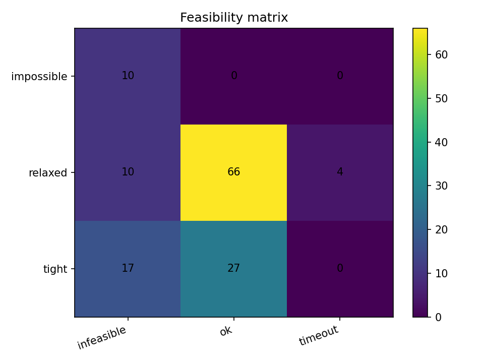
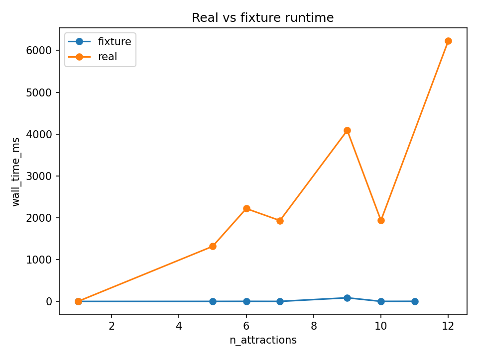

# Experiments Report

Generated automatically from `experiments/outputs/results.csv` and `experiments/outputs/aggregated.csv`.

## Setup

### Prerequisites
- Python env synced in `experiments/` (`just sync`).
- For real-mode runs: GraphHopper + PostGIS started and loaded.

### Run commands
- Fast synthetic: `just experiments-fast-fixture`
- Fast real: `just experiments-fast-real`
- Fast both: `just experiments-fast-both`
- Full synthetic: `just experiments-full-fixture`
- Full real: `just experiments-full-real`
- Full both: `just experiments-full-both`

## Experiment Justification

- **A* greedy vs A* intervals**: checks quality/runtime trade-off from richer stay-time branching.
- **Ablation (heuristic off)**: isolates value of heuristic guidance in search speed.
- **Brute-force baseline**: provides reference objective for small/feasible cases.
- **Boundary cases**: verifies infeasible/timeout handling and robustness.
- **Synthetic vs real matrices**: tests if trends hold when using true Helsinki routing stack.

## Key Tables

### Status by mode and experiment

| mode | experiment | runs | ok | ok_rate |
| --- | --- | --- | --- | --- |
| fixture | astar_greedy | 18 | 12 | 0.667 |
| fixture | astar_intervals | 24 | 18 | 0.75 |
| fixture | astar_intervals_no_heuristic | 10 | 7 | 0.7 |
| fixture | bruteforce_greedy | 10 | 6 | 0.6 |
| fixture | bruteforce_intervals | 10 | 6 | 0.6 |
| real | astar_greedy | 13 | 10 | 0.769 |
| real | astar_intervals | 19 | 15 | 0.789 |
| real | astar_intervals_no_heuristic | 10 | 7 | 0.7 |
| real | bruteforce_greedy | 10 | 6 | 0.6 |
| real | bruteforce_intervals | 10 | 6 | 0.6 |

### Runtime and quality summary

| mode | experiment | avg_ok_rate | avg_wall_time_ms | avg_expanded_nodes | avg_peak_memory_mb | median_objective_cost | avg_stay_utilization |
| --- | --- | --- | --- | --- | --- | --- | --- |
| fixture | astar_greedy | 0.654 | 0.44 | 12.111 | 0.011 | 5616.0 | 0.958 |
| fixture | astar_intervals | 0.744 | 20.912 | 799.333 | 0.188 | 5967.0 | 0.903 |
| fixture | astar_intervals_no_heuristic | 0.722 | 378.905 | 4394.0 | 6.627 | 4212.0 | 0.934 |
| fixture | bruteforce_greedy | 0.611 | 1.847 | 188.167 | 0.021 | 3861.0 | 0.923 |
| fixture | bruteforce_intervals | 0.611 | 33.497 | 1993.667 | 0.241 | 3861.0 | 0.923 |
| real | astar_greedy | 0.788 | 3360.3 | 166.389 | 1.084 | 3091.937 | 0.942 |
| real | astar_intervals | 0.795 | 498.451 | 181.889 | 1.472 | 3088.787 | 0.948 |
| real | astar_intervals_no_heuristic | 0.722 | 626.652 | 4508.0 | 22.108 | 2906.525 | 0.933 |
| real | bruteforce_greedy | 0.611 | 17.834 | 401.5 | 0.109 | 2762.593 | 0.913 |
| real | bruteforce_intervals | 0.611 | 66.843 | 4961.833 | 0.836 | 2762.593 | 0.921 |

### Heuristic speedup summary

| mode | mean_speedup_vs_no_heuristic | sample_count |
| --- | --- | --- |
| fixture | 219.0 | 19 |
| real | 16.09 | 19 |

### Feasibility correctness summary

| mode | checked_cases | correct_cases | correct_rate |
| --- | --- | --- | --- |
| fixture | 17 | 17 | 1.0 |
| real | 17 | 17 | 1.0 |

## Final Plots

### Runtime Scaling

### Expanded Nodes Scaling

### Memory Scaling

### Quality Boxplot

### Optimality Gap

### Heuristic Ablation

### Feasibility Matrix

### Real Vs Fixture

