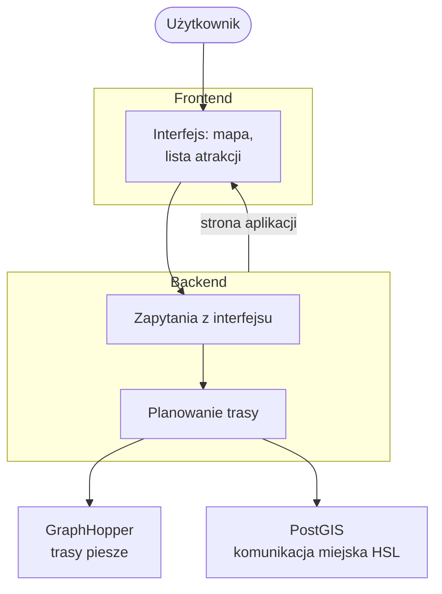

# Architektura

**Reitti** służy do planowania jednodniowej wycieczki po Helsinkach: użytkownik podaje punkt startowy, atrakcje z godzinami otwarcia i ramy czasowe, a system proponuje kolejność odwiedzin oraz szacunkowe czasy i dystanse dojazdów. Szczegóły obliczeń są w [[algorytm]] i [[zalozenia]].

Aplikacja składa się z interfejsu w przeglądarce, serwera aplikacji oraz dwóch usług uruchamianych w Dockerze: bazy danych z rozkładami jazdy i silnika tras pieszych.

## Diagram

Użytkownik wchodzi pod jeden adres (np. `http://127.0.0.1:8000/app/`). Backend obsługuje zarówno stronę aplikacji, jak i zapytania o trasy, przystanki i optymalizację wycieczki.

## Frontend

Warstwa widoczna dla użytkownika jest napisana w **Vue.js** (Pinia). Pokazuje mapę, formularz wycieczki (start, godziny, dzień tygodnia, atrakcje z czasem pobytu) oraz wynik na mapie.

Lista miejsc do wyboru pochodzi z **`GET /places`**. Optymalizacja: **`POST /trip/optimize`** z punktem startowym jako `attractions[0]` i geometrią odcinków (`include_legs`). Kontrakt HTTP: [[implementacja]]. Instalacja: [[instrukcja]].

## Backend

Serwer w **Pythonie** to centrum systemu:

- liczy czasy dojazdu (pieszo i komunikacją miejską), wyszukuje przystanki i **ustala optymalną kolejność odwiedzin** ([[algorytm]]),
- udostępnia interfejs pod adresem `/app/`.

## PostGIS

Baza **PostgreSQL z rozszerzeniem PostGIS** przechowuje dane **GTFS** helsińskiego operatora HSL: przystanki, linie, czasy przejazdów. Na tej podstawie backend szacuje dojazdy komunikacją miejską (m.in. średnie czasy między parami przystanków). Dane ładuje się skryptami z `backend/db/migrations/` po starcie kontenerów.

## GraphHopper

Osobna usługa liczy **trasy piesze** na mapie OpenStreetMap (dystans, czas). Backend odpytuje ją przy każdym odcinku pieszym. Parametry profilu pieszego (prędkość, schody, kierunek startu) - w [[zalozenia]].

## Przykładowy przepływ

Użytkownik ustawia start, godziny wycieczki i kilka atrakcji, potem klika wyznaczenie trasy:

1. Interfejs przekazuje dane do serwera.
2. Serwer liczy czasy dojazdów (GraphHopper, baza HSL) i wybiera kolejność odwiedzin.
3. Użytkownik widzi łączny czas wycieczki i trasę na mapie.

Instalacja: [[instrukcja]].
